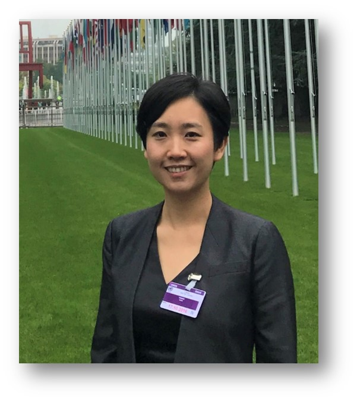
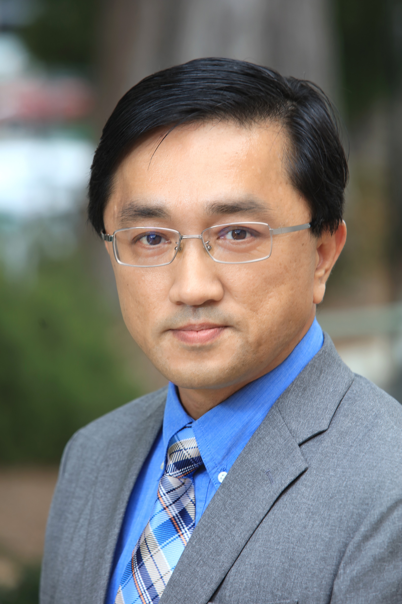
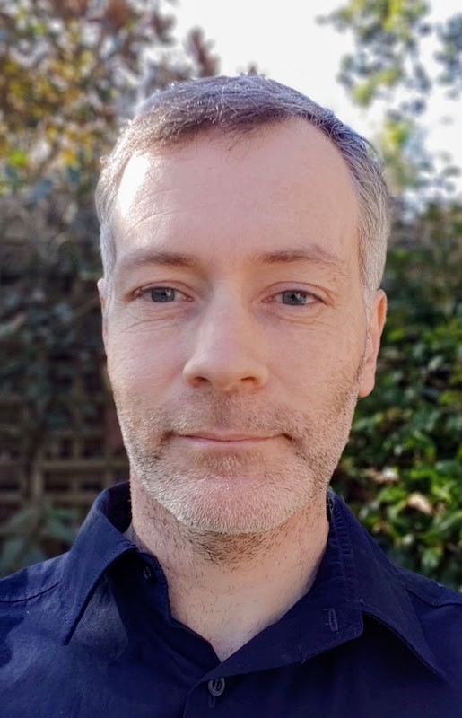

<h1 class='my-center'>Conference Program</h1>
<h4 class='my-center'>(Friday, July 15, or +1: Saturday, July 16)</h4>
<h5 class='my-center'><a href="https://zoom.us/j/94678981515?pwd=L2R4R0haanBTV2l6V1NubGExOTNRQT09">Zoom Link</a></h5>

| PDT Pacific Time   | EDT Eastern Time   | BST London Time        | GMT+8 Beijing Time     |                                                                                                                                                                                                                                                                                                                                             |
|-----------------------|-----------------------|---------------------------|---------------------------|---------------------------------------------------------------------------------------------------------------------------------------------------------------------------------------------------------------------------------------------------------------------------------------------------------------------------------------------|
| 07:20-07:30           | 10:20-10:30           | 15:20-15:30               | 22:20-22:30               | <I>Opening Remarks</I> |
| 07:30-10:00           | 10:30-13:10            | 15:30-18:10              | 22:30-01:10               | <b>Session 1 Invited Talks and Research Paper</b> |
| 07:30-08:10           | 10:30-11:10           | 15:30-16:10               | 22:30-23:10               | <I><a href="#invited-talk-1-by-weiwei-wang">Invited Talk 1: Weiwei Wang</a></I> |
| 08:10-08:50           | 11:10-11:50           | 16:10-16:50               | 23:10-23:50               | <I><a href="#invited-talk-2-by-wallace-chen">Invited Talk 2: Wallace Chen</a></I> |
| 08:50-09:30           | 11:50-12:30           | 16:50-17:30               | 23:50-00:30               | <I><a href="#invited-talk-3-by-trevor-cohn">Invited Talk 3: Trevor Cohn</a></I> |                                                                                                                                                                                                                                                               
| 09:30-10:10           | 12:30-13:10           | 17:30-18:10               | 00:30-01:10 +1            | <I><a href="#invited-talk-4-by-juan-pino">Invited Talk 4: Juan Pino</a></I> | 
| 10:10-10:30           | 13:10-13:30           | 18:10-18:30               | 01:10-01:30 +1            | <I class="prettyI">Research paper: Over-Generation Cannot Be Rewarded: Length-Adaptive Average Lagging for Simultaneous Speech Translation</I> [<a href="assets/docs/slides2022/xxx.pdf" target="_blank">slides</a>] Sara Papi, Marco Gaido, Matteo Negri, Marco Turchi |
| 10:30-18:30           | 13:30-21:30           | 18:30-02:30               | 01:30-09:30 +1     | <b>Break</b> |
| 18:30-20:10           | 21:30-23:10           | 02:30-04:10 +1 | 09:30-11:10 +1 | <b>Session 2: Shared Task</b> |
| 18:30-18:45           | 21:30-21:45           | 02:30-02:45 +1 | 09:30-09:45 +1 | <I class="prettyI">Findings of the Third Workshop on Automatic Simultaneous Translation</I> [<a href="assets/docs/slides2022/xxx.pdf" target="_blank">slides</a>]                             |
| 18:45-19:00           | 21:45-22:00           | 02:45-03:00 +1 | 09:45-10:00 +1 | <I class="prettyI">BIT-Xiaomi’s System for AutoSimTrans 2022</I> [<a href="assets/docs/slides2022/BIT’s_system_for_AutoSimTrans_2021.pdf" target="_blank">slides</a>] Mengge Liu, Xiang Li, Bao Chen, Yanzhi Tian, Tianwei Lan, Silin Li, Yuhang Guo, Jian Luan, Bin Wan    |
| 19:00-19:15           | 22:00-22:15           | 03:00-03:15 +1 | 10:00-10:15 +1 | <I class="prettyI">USST’s System for AutoSimTrans 2022</I> [<a href="assets/docs/slides2022/XMU_Simultaneous_Translati_on_System_at_NAACL_2021.pdf" target="_blank">slides</a>] Zhu Jia Hui, Yu Jun  |
| 19:15-19:30           | 22:15-22:30           | 03:15-03:30 +1 | 10:15-10:30 +1 | <I class="prettyI">System Description on Automatic Simultaneous Translation Workshop</I> [<a href="assets/docs/slides2022/naacl_presentation.pdf" target="_blank">slides</a>] Zecheng Li, Yue Sun, Haoze Li   |
| 19:30-19:45           | 22:30-22:45           | 03:30-03:45 +1 | 10:30-10:45 +1 | <I class="prettyI">System Description on Third Automatic Simultaneous Translation Workshop</I> [<a href="assets/docs/slides2022/BSTC_-_A_Large-Scale_Chinese-English_Speech_Translation_Dataset.pdf" target="_blank">slides</a>] Zhang Yiqiao |
| 19:45-20:00           | 22:45-23:00           | 03:45-04:00 +1 | 10:45-11:00 +1 | <I class="prettyI">End-to-End Simultaneous Speech Translation with Pretraining and Distillation: Huawei Noah’s System for AutoSimTranS 2022</I> [<a href="assets/docs/slides2022/ict_ZhangShaolei_AutoSimTrans_Slides.pdf" target="_blank">slides</a>] Xingshan Zeng, Pengfei Li, Liangyou Li, Qun Liu
| 20:00-20:10           | 23:00-23:10           | 04:00-04:10 +1 | 11:00-11:10 +1 | <I>Closing Remarks</I> |

---
### Invited Talk 1 by Weiwei Wang

	

		
	

	

		<b>Title</b>: Bridging the Gap: CSE-Interpreting Scales as a Measuring Instrument for Interpreting Training
		 
		<b>Abstract</b>: With more than 500 undergraduate and postgraduate degree programs in translation and interpreting (T&I) being launched over the past decade, interpreter training and education has been developing rapidly in China. This creates a huge demand for testing and assessment of interpreting in the educational context. To provide reliable measurement of interpreting competence, the CSE-Interpreting Scales were unveiled in 2018 after 4 years of government-funded research and validation among 30,682 students, 5,787 teachers, and 139 interpreting professionals from 28 provinces, municipalities, and regions in China. In 2022, the scales were developed from conceptual descriptors to an AI-based application to assist in interpreting training. What are the CSE-Interpreting Scales? What are the scenarios and functions of the scales in interpreting training? I will address these questions in my talk by elaborating on two scales and discussing possible applications of the scales in interpreting teaching, learning and assessment.
	

<b>Weiwei WANG</b> is an Associate Professor in the School of Interpreting and Translation Studies at Guangdong University of Foreign Studies. Her research focuses on interpreting quality assessment. She is particularly interested in understanding developmental patterns of interpreting competence and causal factors in competence development. Her research has been published widely in peer-reviewed journals. She has led several research projects funded by the Ministry of Education, the National Social Science Foundation, and the British Council. She is serving as the Deputy Secretary-General of the National Interpreting Committee of the Translation Association of China.

---
### Invited Talk 2 by [Wallace Chen](https://www.middlebury.edu/institute/people/wallace-chen-chenruiqing)

	

		
	

	

		<b>Title</b>: Parsing Techniques in Simultaneous Interpreting and Their Implications for Automatic Simultaneous Translation
		 
		<b>Abstract</b>: Human interpreters employ a wide variety of parsing techniques as dynamic, on-demand strategies to cope with linguistic and communicative challenges associated with simultaneous interpreting (SI). These techniques may include, but not limited to, paraphrasing, generalizing, normalizing, implicitating, explicitating, glossing, shining-through, anticipating, chunking, segmenting, conjoining, etc. -- all prompted by the interpreter's level of experience, cognitive load, and a desire to bridge communicative gaps in the interpreting process. While the technology of automatic simultaneous translation relies on a large set of purpose-built training data to construct a coherent translation, human interpreters make calculated and informed decisions, often on a case-by-case basis, when applying the afore-mentioned parsing techniques for SI. This presentation will focus on the somewhat volatile nature of simultaneous interpreting by exploring how and when the various SI techniques are applied, and how they might be able to shed new insights on the development of automatic simultaneous translation systems.
	

<b>Wallace Chen</b> is Professor and Program Head of Chinese-English Translation and Interpretation at the Middlebury Institute of International Studies at Monterey (MIIS). He holds an MA in Chinese-English Translation and Interpretation (MIIS) and a Ph.D. in Corpus-Based Translation Studies (University of Manchester, UK). Professor Chen has been teaching Chinese-English translation and interpretation (T&I) since 1997. He has over 30 years of experience in practicing T&I, providing services to major corporations, government agencies, and international organizations spanning across Asia and North America. Professor Chen lectures in a wide variety of T&I areas, including professional skill development, pedagogy, T&I technology, professional assessment, T&I practice, and corpus-based T&I studies.

---
### Invited Talk 3 by [Trevor Cohn](https://people.eng.unimelb.edu.au/tcohn/)

	

		
	

	

		<b>Title</b>: From Simultaneous Translation to Simultaneous Interpretation
		 
		<b>Abstract</b>: Simultaneous translation is a highly challenging problem, both for humans and for machines, bringing many additional complexities beyond offline translation. In this talk I will discuss two avenues for advancing research automatic simultaneous translation, encompassing both algorithms and evaluation methodology. First, I will discuss means of improving the realism of models learned from parallel translation data, based on factoring the system into two components: a programmer, which decides when to wait for more input and when to produce translations, and an interpreter, which generates the output tokens. Critically, our method couples the learning of these components, framed as imitation learning, which leads to better simultaneous translation than simply learning a single component, as in prior work. In the second part of the talk, I will revisit a core assumption underlying modern simultaneous translation work, namely the use of parallel offline translation data for evaluation. Instead, I will argue that interpretation data is a better evaluation resource. Interpretation differs substantially from offline translation and includes a range of translation strategies humans to perform this cognitively challenging task in a real-time setting. I will describe a small dataset we curated from the audio and transcripts of European parliament debates. Leading simultaneous translation systems evaluated on this dataset fare quite poorly, relative to standard translation-based evaluation corpora. I will finish by showing how we can adapt existing methods to improve performance on this highly challenging interpretation task.
	

<b>Trevor Cohn</b> is a Professor in the School of Computing and Information Systems at The University of Melbourne, and Director of the ARC Training Centre in Cognitive Computing for Medical Technologies. He was previously employed at the University of Sheffield and the University of Edinburgh. His research interests focus on development of probabilistic and statistical machine learning methods for modelling natural language text, with particular focus in machine translation, multilingual model transfer and model robustness to adversarial attacks. He has projects ranging from privacy preserving learning, ameliorating cultural bias from models of language, and natural language understanding of patent documents. He has best paper awards from top tier conferences, including EMNLP and ACL. He served as the Programme Chair of EMNLP, architecting the “Findings” companion publication, and is an action editor for Transactions of the ACL, among other service roles. Trevor completed his PhD in Engineering in 2007 at The University of Melbourne.

---
### Invited Talk 4 by [Juan Pino](https://ai.facebook.com/people/juan-pino/)

	

		
	

	

		<b>Title</b>: Recent Advances in Direct Speech to Speech Translation
		 
		<b>Abstract</b>: Speech to speech translation is the task of translating from audio in a language to audio in a different language. Simply combining speech recognition, machine translation and speech synthesis provides a very strong baseline but with some possible drawbacks. We propose to solve the problem in a more direct fashion to potentially provide less error compounding, lower latency and also support translation into unwritten languages or languages without standard writing system. In this presentation, I will describe recent advances on direct speech-to-speech translation, systems with simultaneous capability and that leverage real target speech.
	

<b>Juan Pino</b> is a Research Scientist at Meta AI since 2014. He studied machine translation at the University of Cambridge with Professor Bill Byrne. Juan is currently interested in developing end-to-end simultaneous speech translation models.

