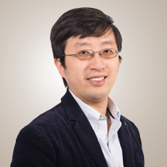

<h1 class='my-center'>Conference Program</h1>
<h4 class='my-center'>(Thursday, June 10, or +1: Friday, June 11)</h4>
<h5 class='my-center'><a href="https://zoom.us/j/94678981515?pwd=L2R4R0haanBTV2l6V1NubGExOTNRQT09">Zoom Link</a></h5>

*There is a swap between Talk 3 and Talk 4 from original schedule

| PDT Pacific Time   | EDT Eastern Time   | BST London Time        | GMT+8 Beijing Time     |                                                                                                                                                                                                                                                                                                                                             |
|-----------------------|-----------------------|---------------------------|---------------------------|---------------------------------------------------------------------------------------------------------------------------------------------------------------------------------------------------------------------------------------------------------------------------------------------------------------------------------------------|
| 07:15-07:30           | 10:15-10:30           | 15:15-15:30               | 22:15-22:30               | <I>Opening Remarks</I>                                                                                                                                                                                                                                                                                                                      |
| 07:30-10:10           | 10:30-13:10           | 15:30-18:10               | 22:30-01:10               | <b>Session 1 Invited Talks</b>                                                                                                                                                                                                                                                                                                              |
| 07:30-08:10           | 10:30-11:10           | 15:30-16:10               | 22:30-23:10               | <I><a href="#invited-talk-1-by-hong-jiang">Invited Talk 1: Hong Jiang</a></I>                                                                                                                                                                                                                                                               |
| 08:10-08:50           | 11:10-11:50           | 16:10-16:50               | 23:10-23:50               | <I><a href="#invited-talk-2-by-lucia-specia">Invited Talk 2: Lucia Specia</a></I>                                                                                                                                                                                                                                                           |
| 08:50-09:30           | 11:50-12:30           | 16:50-17:30               | 23:50-00:30               | <I><a href="#invited-talk-3-by-will-lewis">Invited Talk 3: Will Lewis</a></I>                                                                                                                                                                                                                                                               |
| 09:30-10:10           | 12:30-13:10           | 17:30-18:10               | 00:30-01:10 +1 | <I><a href="#invited-talk-4-by-liang-huang">Invited Talk 4: Liang Huang</a></I>                                                                                                                                                                                                                                                             |
| 10:10-19:00           | 13:10-22:00           | 18:10-03:00               | 01:10-10:00 +1 | <b>Break</b>                                                                                                                                                                                                                                                                                                                                |
| 19:00-20:20           | 22:00-23:20           | 03:00-04:20 +1 | 10:00-11:20 +1 | <b>Session 2: Research Paper and System Description</b>                                                                                                                                                                                                                                                                                     |
| 19:00-19:10           | 22:00-22:10           | 03:00-03:10 +1 | 10:00-10:10 +1 | <I class="prettyI">Findings of the Second Workshop on Automatic Simultaneous Translation</I> [<a href="assets/docs/slides2021/Findings_of_the_Second_Workshop_on_Automatic_Simultaneous_Translation.pdf" target="_blank">slides</a>] Ruiqing Zhang, Chuanqiang Zhang, Zhongjun He, Hua Wu and Haifeng Wang                               |
| 19:10-19:20           | 22:10-22:20           | 03:10-03:20 +1 | 10:10-10:20 +1 | <I class="prettyI">BIT’s system for AutoSimulTrans2021</I> [<a href="assets/docs/slides2021/BIT’s_system_for_AutoSimTrans_2021.pdf" target="_blank">slides</a>] Mengge Liu, Shuoying Chen, Minqin Li, Zhipeng Wang and Yuhang Guo                                                                                                        |
| 19:20-19:30           | 22:20-22:30           | 03:20-03:30 +1 | 10:20-10:30 +1 | <I class="prettyI">XMU’s Simultaneous Translation System at NAACL 2021</I> [<a href="assets/docs/slides2021/XMU_Simultaneous_Translati_on_System_at_NAACL_2021.pdf" target="_blank">slides</a>] Shuangtao Li, Jinming Hu, Boli Wang, Xiaodong Shi and Yidong Chen                                                                        |
| 19:30-19:40           | 22:30-22:40           | 03:30-03:40 +1 | 10:30-10:40 +1 | <I class="prettyI">System Description on Automatic Simultaneous Translation Workshop</I> [<a href="assets/docs/slides2021/naacl_presentation.pdf" target="_blank">slides</a>] Linjie Chen, Jianzong Wang, Zhangcheng Huang, Xiongbin Ding and Jing Xiao                                                                                  |
| 19:40-19:50           | 22:40-22:50           | 03:40-03:50 +1 | 10:40-10:50 +1 | <I class="prettyI">BSTC: A Large-Scale Chinese-English Speech Translation Dataset</I> [<a href="assets/docs/slides2021/BSTC_-_A_Large-Scale_Chinese-English_Speech_Translation_Dataset.pdf" target="_blank">slides</a>] Ruiqing Zhang, Xiyang Wang, Chuanqiang Zhang, Zhongjun He, Hua Wu, Zhi Li, Haifeng Wang, Ying Chen and Qinfei Li |
| 19:50-20:00           | 22:50-23:00           | 03:50-04:00 +1 | 10:50-11:00 +1 | <I class="prettyI">ICT’s System for AutoSimTrans 2021: Robust Char-Level Simultaneous Translation</I> [<a href="assets/docs/slides2021/ict_ZhangShaolei_AutoSimTrans_Slides.pdf" target="_blank">slides</a>] Shaolei Zhang and Yang Feng                                                                                                 |
| 20:00-20:20           | 23:00-23:20           | 04:00-04:20 +1 | 11:00-11:20 +1 | <I>Q&A</I>                                                                                                                                                                                                                                                                                                                                  |
| 20:20-20:30           | 23:20-23:30           | 04:20-04:30 +1 | 11:20-11:30 +1 | <I>Closing Remarks</I>                                                                                                                                                                                                                                                                                                                      |

---
### Invited Talk 1 by [Hong Jiang](http://traserver.tra.cuhk.edu.hk/en/people_detail.php?cate=Lecturers&ppid=52)

	

		
	

	

		<b>Title</b>: Anticipation in Simultaneous Interpreting
		 
		<b>Abstract</b>: Anticipation is an indispensable language processing and cognitive effort in simultaneous interpreting. It is necessitated by the time pressure, language differences and working memory constraints in the simultaneous interpreting process. While working memory is found to be similar between novices and professionals in a non-context dependent task, conceptual knowledge, linguistic proficiency, and general analytical abilities are contributors to successful anticipation. Interpreters need to identify markers that prompt anticipation, in order to comprehend source speech, strategize output, and prioritize key messages when stressed in processing capacity. Training of anticipation include identifying markers, and devising multiple output options, in addition to knowledge enhancement. 
	

<b>Ms. Hong JIANG</b> is currently a Senior Lecturer in the Department of Translation, Chinese University of Hong Kong. A graduate of the United Nations Training Programme for Interpreters and Translators, she is a former UN staff interpreter. She holds a Master of Advanced Studies in Interpreter Training from the University of Geneva and has won teaching awards for outstanding teaching performance at multiple higher education institutions in China and Hong Kong. A member of AIIC since 1997, she has served on AIIC’s Training Committee since 2012. She regularly sits on juries for professional examinations and interpreting competitions in China. Her research interests are in interpreter training and professional expertise development.

---
### Invited Talk 2 by [Lucia Specia](https://www.imperial.ac.uk/people/l.specia)

	

		
	

	

		<b>Title</b>: Multimodal Simultaneous Machine Translation
		 
		<b>Abstract</b>: Simultaneous machine translation (SiMT) aims to translate a continuous input text stream into another language with the lowest latency and highest quality possible. Therefore, translation has to start with an incomplete source text, which is read progressively, creating the need for anticipation. In this talk I will present work where we seek to understand whether the addition of visual information can compensate for the missing source context. We analyse the impact of different multimodal approaches and visual features on state-of-the-art SiMT frameworks, including fixed and dynamic policy approaches using reinforcement learning. Our results show that visual context is helpful and that visually-grounded models based on explicit object region information perform the best. Our qualitative analysis illustrates cases where only the multimodal systems are able to translate correctly from English into gender-marked languages, as well as deal with differences in word order, such as adjective-noun placement between English and French.
	

<b>Lucia Specia</b> is Professor of Natural Language Processing at Imperial College London, with part-time appointments at the University of Sheffield and Dublin City University. Her research focuses on various aspects of data-driven approaches to language processing, with a particular interest in multimodal and multilingual context models and work at the intersection of language and vision. Her work has been applied to various tasks such as machine translation, image captioning, text adaptation and quality estimation. She is also interested in making machine translation useful for end-users, where tools like quality estimation and automatic post-editing play a big role. She is the recipient of the MultiMT ERC Starting Grant on Multimodal Machine Translation (2016-2021) and is also currently involved in research projects on in-browser machine translation and quality estimation, as well as multilingual referential grounding. In the past she worked as Senior Lecturer at the University of Wolverhampton (2010-2011), and research engineer at the Xerox Research Centre, France (2008-2009, now Naver Labs). She received a PhD in Computer Science from the University of São Paulo, Brazil, in 2008.

---
### Invited Talk 3 by [Will Lewis](https://www.linkedin.com/in/will-lewis-24b39511/)

	

		
	

	

		<b>Title</b>: Automated Speech Translation in the Educational Setting
		 
		<b>Abstract</b>: Educational institutions frequently cater to linguistically diverse populations. In higher education, we see this diversity in students who attend colleges outside of their home country, where they attend classes in a language that they may not know or may not know well. In primary and secondary education, children of recent immigrant populations are often placed in classrooms where they do not speak the language of instruction and whose parents are also at a disadvantage for the same reason. In the latter case, especially in the United States, the numbers of students and languages spoken is staggering: in 2015, 9.5 percent of the student population in the US, some 4.8 million students, were listed as English Language Learners (ELL), and some school districts in the US have more than 100 languages spoken by students and parents at their schools. Given the size and diversity of ELL populations, many schools have turned to automatic solutions, specifically various speech translation tools, to satisfy the need. Although speech translation technology has vastly improved in the past few years, there are still issues with translation quality and latency, which can interact with the user experience. Success in the schools has been variable, depending on where and how the tools are used, and how the expectations have been set across educator and parent/student populations. What kinds of issues do schools run into using these tools? What are the primary scenarios where schools use the tools? What kinds of improvements have been made or can be made to improve the perceived quality and user experience in these settings? Are the tools used interactively, e.g., between parents and educators, and are solutions with voice output, e.g., TTS, used or preferred? I will address these questions in my talk, and review solutions that are now becoming widely popular in the schools, looking specifically at issues with one or more of the most popular classroom tools. I will also demo a solution as part of my talk.
	

<b>Will Lewis</b> is an Affiliate Assistant Professor at the University of Washington. Until recently he was a Principal PM Architect with the Microsoft Translator team and had led the team's efforts to build Machine Translation engines for a variety of the world's languages, including threatened and endangered languages.  More recently he had been working with the Translator team on Speech Translation and Transcription, developing the features that allow students to use Speech Translation in the classroom, for both multilingual and deaf and hard of hearing audiences.  Before joining Microsoft, Will was Assistant Professor and founding faculty for the Computational Linguistics Master's Program at the University of Washington.  Before that, he was faculty at CSU Fresno, where he helped found the Computational Linguistic and Cognitive Science Programs at the university.  He received a Bachelor's degree in Linguistics from the University of California Davis and a Master's and Doctorate in Linguistics, with an emphasis in Computational Linguistics, from the University of Arizona in Tucson. 

---
### Invited Talk 4 by [Liang Huang](http://web.engr.oregonstate.edu/~huanlian)

	

		
	

	

		<b>Title</b>: Towards Simultaneous Speech-to-Text and Speech-to-Speech Translation
		 
		<b>Abstract</b>: Simultaneous translation, which was once considered out of reach for the current technology, gained rejuvenated interest since the breakthrough in 2019. Nowadays, it is widely considered to be not only solvable, but even commercializable in the near future. However, there remain several major technical difficulties before this technology can be widely used, esp. in the speech-to-speech setting. Therefore there is still a significant need for new ideas. I will survey our recent progress towards this goal, and in particular in the following areas:
<ol type="a">
   <li>adaptive policies and opportunistic decoding </li>
   <li>incremental text-to-speech synthesis and simultaneous speech-to-speech translation pipeline </li>
   <li>simultaneous direct speech-to-text translation </li>
   <li>multimodal training for direct speech-to-text translation </li>
</ol> I will end the talk with some open questions and future directions.
	

<b>Liang Huang</b> is a Distinguished Scientist at Baidu Research USA and an Associate Professor of EECS at Oregon State University. He is a computational linguist (parsing, translation, grammar formalisms) and a computational biologist (RNA/protein folding & design for COVID-19). His recognitions include ACL 2019 Keynote Speech, CVPR 2021 Keynote Speech, ACL 2008 Best Paper Award, EMNLP 2016 Best Paper Honorable Mention, and several best paper finalists (ACL 2007, EMNLP 2008, ACL 2010, SIGMOD 2018). His work on simultaneous translation rejuvenated wide interest in this classical problem which was once thought to be out of reach. He also applies computational linguistics algorithms to RNA biology with applications to COVID-19, where his work on mRNA vaccine design is being verified by several major vaccine companies.

